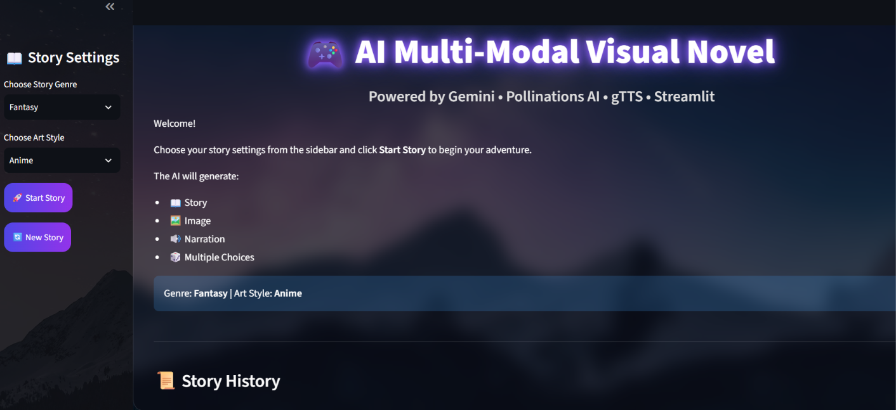
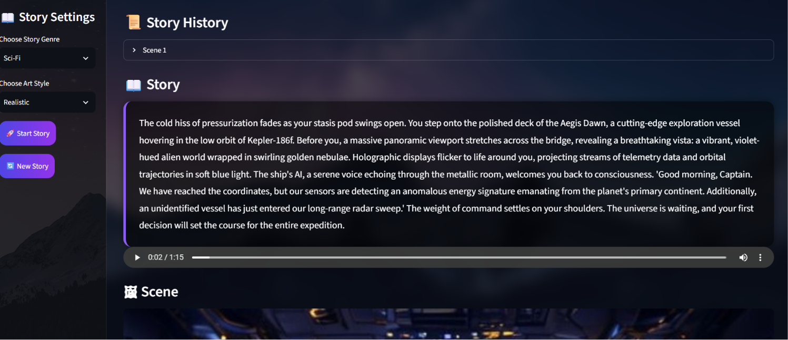
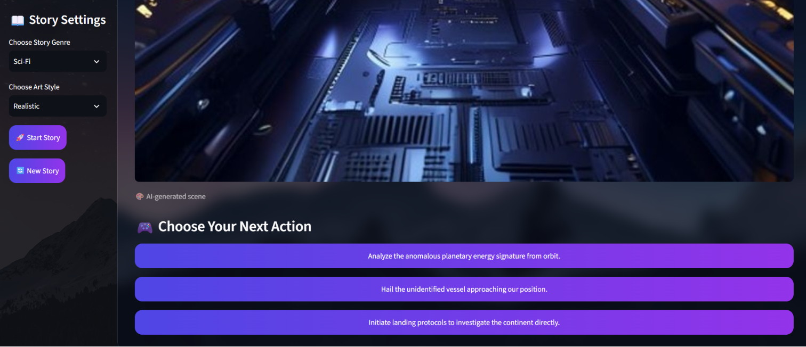
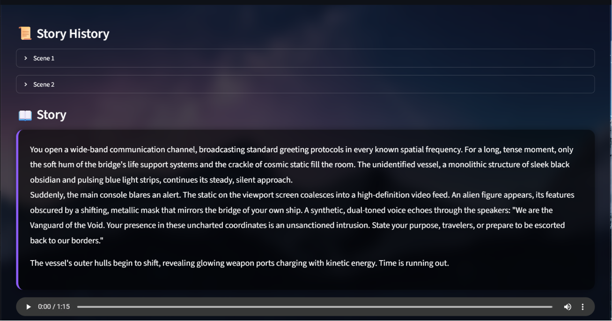

# 🎮 AI Multi-Modal Visual Novel

An interactive **Choose Your Own Adventure** game built with **Streamlit**, powered by **Google Gemini AI**, **Pollinations AI**, and **gTTS**. The application generates an evolving story, AI-created illustrations, and narrated audio while allowing users to shape the adventure through dynamically generated choices.
---
## 🌐 Live Demo

🚀 https://ai-multimodal-visual-novel.streamlit.app/

---

## ✨ Features

* 📖 AI-generated interactive story using Google Gemini
* 🖼️ AI-generated scene illustrations with Pollinations AI
* 🔊 Text-to-Speech narration using gTTS
* 🎮 Dynamic choice buttons generated from AI responses
* 📂 Structured JSON parsing for reliable AI output
* 💾 Stateful story progression using Streamlit Session State
* ⚡ Cached Gemini client with `@st.cache_resource`
* 🛡️ Graceful error handling using `try...except`
* 📜 Story history viewer
* 🔄 Start a brand-new adventure with one click

---

## 🛠️ Technologies Used

* Python
* Streamlit
* Google Gemini API
* Pollinations AI
* gTTS (Google Text-to-Speech)
* Pillow (PIL)
* Requests
* JSON
* Python Dotenv

---

## 📁 Project Structure

```text
Visual-Novel-AI/
│
├── app.py
├── requirements.txt
├── README.md
├── .env.example
├── .gitignore
├── screenshots/
├── audio/
└── images/
```

---

## 🚀 Installation

### Clone the repository

```bash
git clone https://github.com/your-username/Visual-Novel-AI.git
cd Visual-Novel-AI
```

### Create a virtual environment

**Windows**

```bash
python -m venv venv
venv\Scripts\activate
```

### Install dependencies

```bash
pip install -r requirements.txt
```

### Configure the API key

Create a `.env` file:

```env
GEMINI_API_KEY=YOUR_API_KEY
```

### Run the application

```bash
streamlit run app.py
```

---

## 🎯 How It Works

1. Select a **Story Genre**.
2. Select an **Art Style**.
3. Click **Start Story**.
4. Gemini generates a structured JSON response containing:

   * Story text
   * Image prompt
   * Three adventure choices
5. The application parses the JSON.
6. Pollinations AI generates a matching illustration.
7. gTTS creates audio narration.
8. Click any generated option to continue the adventure.

---

## 📸 Screenshots

* Home Screen


* Story Generation


* Dynamic Choice Buttons


* Story Continuation


---

## 📚 Learning Outcomes

This project demonstrates:

* Streamlit application development
* Google Gemini API integration
* JSON parsing in Python
* Dynamic UI generation
* Session state management
* AI image generation
* Text-to-Speech integration
* API error handling
* Building interactive AI applications

---

## 🔮 Future Improvements

* Save and load game progress
* Multiple language support
* Background music and sound effects
* Character avatars
* Inventory system
* Difficulty levels
* User authentication
* Cloud deployment

---

## 👨‍💻 Author

**Mohamed Athif**

- 🎓 B.E. Computer Science Engineering
- 📍 Bengaluru, India

GitHub:
https://github.com/mohamedathif040-netizen

---

## 📄 License

This project is created for educational and learning purposes.

---

⭐ If you like this project, consider giving it a Star on GitHub!
